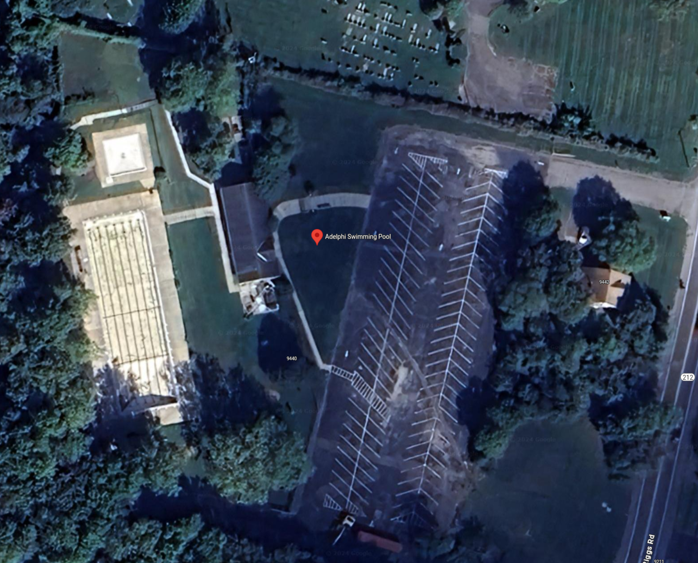

# adelphi-pool

Details about the Adelphi Pool Layout

# Information

## Short course pool

* The short course pool length is 82 ft 2 in, which is 82.166 ft or 25 m (82.252 ft). 
* The width is 50 ft (same as old).
* There are six lanes, and they are 8 ft wide, with a 1 ft gap at each edge. This means we need 7 lane ropes for this distance.
* The backstroke flags are positioned 15 ft, which is 5 y not 5 m.
* The depth at the pool house side starts at 5 ft ending at 12 ft 6 in at the far edge (close to the old start end).
* The depth at the opposite side is mostly the same, though the grading starts in a different lane.

## Long course pool

* The long course pool length is 164 ft 2 in, which is 50.028m (same as old)
* The width is 50 ft (same as old).
* There are six lanes, and they are 8 ft wide, with a 1 ft gap at each edge. This means we need 7 lane ropes for this distance.
* The backstroke flags are positioned 15 ft, which is 5 yd, not 5 m.
* The depth at the diving board side (old start end, new start end) is 9 ft at lane 1 (close to pool house) and 12 ft 6 in at the opposite side (lane 6).
* The depth at the finish side is 3 ft across, and becomes 4 ft maybe 10 ft after the expansion joint (maybe the 25 m point?) and then 3 ft the rest of the
way in starting another 12 ft further.

# Questions about the Pool

1. Are the ladders removable?
2. Are the guard chairs anchored and removable, or are the all portable?  A note seems to indicate they are movable.
3. They depict starting block anchors on the pool house side.  We don't need anchors.
4. Are the diving boards removable?
5. It seems there are some electrical outlets at the far side of the competition pool to the left about 25 ft from the edge of the pool at marker 11. There
   are also some along the fence on the opposite side (no number listed).  We need to identify a place for the computer stuff, as well as possibly
   location for ethernet (via conduit) and wifi.
6. How much room is there from the pool to the fence?  I can't find the dimension. It seems like about 20 ft.

# General Questions, Comments,  Topics

1. How many lane ropes do we have right now?  How long are they?  Will they work for both 50m and 25m?
2. We have 5 10 ft by 10 ft tents.  We'll need to make sure they can line up properly with the 6 lanes and not block starts.
3. We'd like to get on site and get a better feel for space, take some non-pool measurements, etc.

# Notes

1. A few notes - the plans show starting blocks, but we did not include these as they are not used in PMSL.
   * This answers the question above.
1. In the 25 m configuration, we'll have a 1 foot gutter and lane ropes on each side of the pool to avoid removing ladders during competition, which means we'll need to buy 7 25m lane ropes to create the 6 lanes.
  * This doesn't quite answer the removable ladder question, but it seems to mitigate it.
  * Do we really need to buy ropes for the 25 m course?  The 50m course will not be setup simultaneously.
1. We should not need to buy new ropes for the 50m configuration as we can use our existing ropes.

# USA Swimming Rules for Equipment

# Recommendations

1. We use the far end (away from the pool house) as the start and finish end for event of distance 50, 100, and 200 (medley relay, free relay). This makes lane 1 on the right (when
looking at the drawing) and lane 6 on the lft.
2. We use the near end (close to the pool house) as the start end (like Strathmore) and the finish end remains the same as above.
3. This setup means we can keep the timers in one place vs walking around many times, as well as locate tents at the start end for the swimmers and timers.
4. Place the computer table at the outlets listed above (marker 11) and cover with a tent (lane 6 side).
5. Plase the starter at the opposite side and cover with a tent (lane 1 side).  This makes it quicker for a referee to get to the far side (25 m start, 25 m turn) for DQ conversations.

# Diagrams

Old pool overhead view from Google Maps (2024-02-22)

