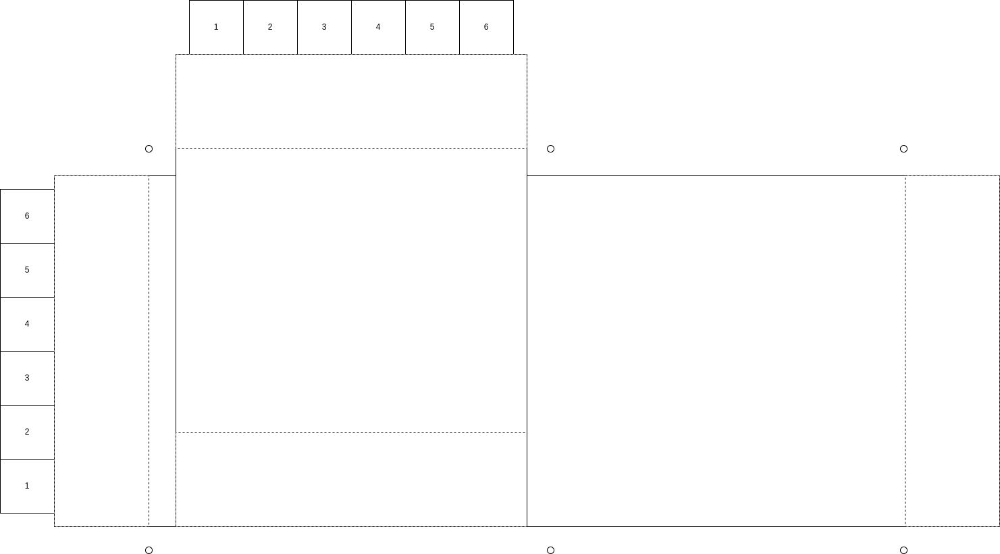

# adelphi-pool

Details about the Adelphi Pool Layout

# Information

## Short course pool

* The short course pool length is 82 ft 2 in, which is 82.166 ft or 25 m (82.252 ft). 
* The width is 50 ft (same as old).
* There are six lanes, and they are 8 ft wide, with a 1 ft gap at each edge. This means we need 7 lane lines for this distance.
* The backstroke flags are positioned 15 ft, which is 5 y not 5 m.
* The depth at the pool house side starts at 5 ft ending at 12 ft 6 in at the far edge (close to the old start end).
* The depth at the opposite side is mostly the same, though the grading starts in a different lane.

## Long course pool

* The long course pool length is 164 ft 2 in, which is 50.028m (same as old)
* The width is 50 ft (same as old).
* There are six lanes, and they are 8 ft wide, with a 1 ft gap at each edge. This means we need 7 lane lines for this distance.
* The backstroke flags are positioned 15 ft, which is 5 yd, not 5 m.
* The depth at the diving board side (old start end, new start end) is 9 ft at lane 1 (close to pool house) and 12 ft 6 in at the opposite side (lane 6).
* The depth at the finish side is 3 ft across, and becomes 4 ft maybe 10 ft after the expansion joint (maybe the 25 m point?) and then 3 ft the rest of the
way in starting another 12 ft further.

# Questions about the Pool

1. Are the ladders removable?
1. Are the guard chairs anchored and removable, or are the all portable?  A note seems to indicate they are movable.
1. They depict starting block anchors on the pool house side.  We don't need anchors.
1. Are the diving boards removable?
1. It seems there are some electrical outlets at the far side of the competition pool to the left about 25 ft from the edge of the pool at marker 11. There
   are also some along the fence on the opposite side (no number listed).  We need to identify a place for the computer stuff, as well as possibly
   location for ethernet (via conduit) and wifi.
1. How much room is there from the pool to the fence?  I can't find the dimension. It seems like about 20 ft.
1. Are the backstroke flag stanchions permamently mounted (poles always there) or removable?
1. Do they have a recommendation for how to setup the flags for the turn end (close to pool house) flags, suspended over the 50m pool?

# General Questions, Comments,  Topics

1. How many lane lines do we have right now?  How long are they?  Will they work for both 50m and 25m?  We join 25m lines together to make the 50m length, right?
1. We have 5 10 ft by 10 ft tents.  We'll need to make sure they can line up properly with the 6 lanes and not block starts.
1. We'd like to get on site and get a better feel for space, take some non-pool measurements, etc.
1. Can we get a full diagram of the entire grounds with the new pools shown, including the deck?  Something that shows the fences, operations shed, dolphin shed, steps out the back,
   volleyball court, fence separating deck and grounds, etc.
1. It seems like we need to get a new set of flags. Given the pool width is 50 ft for both the 25m and 50m pool, the same ones could be used for both as they would not be
   setup simultaneously.
1. We need to schedule time or a meeting with PMSL to review the plan(s) and certainly inspect the pool for validation.  If built based on the drawings I see no reason why it
   will be a problem for the 25m pool, given it adheres to all of the USA Swimming specifications. The only issue possibly is that the flags are 5y from the ends vs 5m.  It does
   seem the rules permit this though.

# Notes

1. A few notes - the plans show starting blocks, but we did not include these as they are not used in PMSL.
   * This answers the question above.
1. In the 25 m configuration, we'll have a 1 foot gutter and lane lines on each side of the pool to avoid removing ladders during competition, which means we'll need to buy 7 25m lane lines to create the 6 lanes.
  * This doesn't quite answer the removable ladder question, but it seems to mitigate it.
  * Do we really need to buy lines for the 25 m course?  The 50m course will not be setup simultaneously.
1. We should not need to buy new lines for the 50m configuration as we can use our existing lines.

# Rules for Equipment
## USA Swimming

103.1 DEFINITIONS
 - .1 /M/ = Indicates mandatory requirement for all competition.
 - .2 /NC/ = Except as noted otherwise, indicates mandatory requirement for USA Swimming
Championships and International Competition.
 - .3 /LSC/ = Predicated on facility availability, LSCs may waive strict compliance with these
requirements in sanctioning local competition.
 - .4 Where dimensions are given, the dime

### Number of Lanes
### Width per Lane
### Depth 

103.2 WATER DEPTH
- .1 /NC/ 2 meters (6 feet 7 inches) deep throughout the course.
- .2 /M/ Teaching Racing Starts — Minimum water depth for teaching all racing starts, prior to
certification, in any setting from any height starting blocks, from backstroke ledges or from the
deck shall be 6 feet (1.84 meters) measured for a distance of 3 feet 3-1/2 inches (1.0 meter)
to 16 feet 5 inches (5.0 meters) from the end wall. Teaching racing starts shall only take place
under the direct supervision of a USA Swimming member coach and shall include:
  - A All racing start instruction until a swimmer has been certified by his or her USA Swimming member coach as proficient in performing a racing start; and
  - B Subsequent to certification, instruction which seeks to alter a swimmer’s basic technique in performing a racing start.
Prior to certification, all racing starts must take place from a position in the water, and without
use of the backstroke ledge, regardless of pool depth. Subsequent to certification, practicing
of racing starts may take place in water depth of four (4) feet (1.22 meters) and deeper.
- .3 /M/ Racing Starts — Minimum water depth for racing starts during practice and competition
shall be measured for a distance 3 feet 3-1/2 inches (1.0 meter) to 16 feet 5 inches (5.0
meters) from the end wall. Starting requirements and height of starting block shall be:
  - A In pools with water depth less than 4 feet (1.22 meters) at the starting end;
    - (1) The swimmer must start in the water;
    - (2) Backstroke starting ledges are not permitted.
  - B In pools with water depth 4 feet (1.22 meters) or more at the starting end, starting platforms shall meet the height requirements of 103.14.1.
Note: Local, state and municipal statutes, ordinances, rules and regulations, may have
depth limitations in conflict with this section. The LSC and all Member Clubs should check
for this at all times.

### Backstroke Flags

103.17 /M/ BACKSTROKE FLAGS AND LINES
- .1 Design: At least three triangular pennants six (6) to twelve (12) inches in width at the base
and twelve (12) to eighteen (18) inches in vertical length, of two or more alternating and contrasting colors shall be suspended on a firmly stretched line over each lane during all warm-up
periods and during competition for all backstroke, individual medley and medley relay events.
- .2 Location:
  - A Long course and short course meters: 5 meters (16 feet 5 inches) from each end of
the course, a minimum of 1.8 meters (5 feet 11 inches) to a maximum of 2.5 meters (8
feet 3 inches) above the water surface.
  - B Short course yards: 15 feet (4.57 meters) from each end of the course, 7 feet (2.13
meters) above the water surface.
  - C Height shall be measured to the horizontal line from which the pennants are suspended

### Ladders

## PMSL

# Recommendations

1. We use the far end (away from the pool house) as the start and finish end for event of distance 50, 100, and 200 (medley relay, free relay). This makes lane 1 on the right (when
looking at the drawing) and lane 6 on the lft.
1. We use the near end (close to the pool house) as the start end (like Strathmore) and the finish end remains the same as above.
1. This setup means we can keep the timers in one place vs walking around many times, as well as locate tents at the start end for the swimmers and timers.
1. It also does not obscure the pool from spectators on the hill.
1. Place the computer table near the outlets listed above (marker 11) and cover with a tent (lane 6 side), on the deck.
1. Place the starter at the opposite side and cover with a tent (lane 1 side).  This makes it quicker for a referee to get to the far side (25 m start, 25 m turn) for DQ conversations.
1. Place the clerk of course behind the computer table, in the area which used to be the visiting team seating area and the old slide.
1. This does present a challenge for where the teams will sit. Though, if we move clerk of course, we could have Adelphi sitting in the former clerk of course area (volleyball court)
   and the visiting team in the picnic area next to the pool house.

## Backstroke Flag Concept

This T layout of the pool offers a challenge in setting up backstroke flags for the turn end, given it's completely in the middle of the 50m pool.  Here are my ideas on the 
backstroke flags.

The flags must be a minimum of 5 ft 11 in and a max of 8 ft 3 in above the water surface.

### Start End

I'm dubbing the area at the fence as the start end.  The two flag posts are on either side of the pool, 5y from the start. We use a coated rope (perhaps something
like [this](https://www.amazon.com/Wire-Center-Flagpole-Rope-feet/dp/B079NKDPYR/ref=asc_df_B079NKDPYR/?tag=hyprod-20&linkCode=df0&hvadid=242081901753&hvpos=&hvnetw=g&hvrand=8853139327221922408&hvpone=&hvptwo=&hvqmt=&hvdev=c&hvdvcmdl=&hvlocint=&hvlocphy=1018624&hvtargid=pla-418964692933&mcid=6d8d6fab8a993cb885faec5587afbb50&gclid=Cj0KCQiAxOauBhCaARIsAEbUSQQ6p7pM0DBkKBjBSmeE_JOYcCeJdGyKe14gOP_3O1xtfIZyYp0EzYUaAl9fEALw_wcB&th=1)). The top of the pool would have two rings, one to be used for the flag rope across the 25m pool, and the other perpenticular to cross the 50m to the far
side for the support of the turn end flags. Something like [this](https://www.recreonics.com/product/sliding-collar-with-two-eyebolts/).  Each start end pole would have this sort of setup.

One end of the flag rope would use a swivel hook (like [this](https://www.recsupply.com/competitor-swivel-hook-for-backstroke-flags-mm2082814)), and the other end would be looped through the ring.
There would be extra rope on that side, to make it easier to setup (clip one end, walk the other end, pass it through the loop, and anchor it). To anchor the rope, we use a
cleat, something like [this](https://www.amazon.com/YYST-Stainless-Steel-Cleat-Hardware/dp/B07CC98TH6?source=ps-sl-shoppingads-lpcontext&ref_=fplfs&psc=1&smid=A9VAKYMMFXG39).  This allows for
anchoring and adjustability.  Alternatively, we could also have another swivel hook on this side (one that is somewhat adjustable), and still have the extra rope, but the rope doesn't
need more than to be wrapped around the pool neatly.

For setup, let's say the rope is 60 ft (min 53-54 ft to not drop in water on the diagonal), with 50 ft of flag.  We clip the lane 6 side in place, walk around th$ start end, and then clip the
flag in place on the opposite pole, and tidy up the rope (or anchor with cleats).

### Turn End

This gets more complicated.  The pole on this site would need only one ring at the top, as they will connect only in one direction across the 50m pool.  As with the start end,
we use a swivel loop on one end of the rope, hooked up at the start end (for both ropes).  This is a two-section rope.  This first long section terminates in a metal ring
(like [this](https://www.amazon.com/Stainless-Steel-Round-Welded-Marine/dp/B08R6JWR8G/ref=asc_df_B08R6JWR8G/?tag=hyprod-20&linkCode=df0&hvadid=475691994600&hvpos=&hvnetw=g&hvrand=11721887966251946494&hvpone=&hvptwo=&hvqmt=&hvdev=c&hvdvcmdl=&hvlocint=&hvlocphy=1018624&hvtargid=pla-1150673756089&psc=1&mcid=10a7c1cbf19d3a0694ddc0fb289b05de&gclid=Cj0KCQiAxOauBhCaARIsAEbUSQQ1_fnUHmKUbAMYeH3dJWoQTxMQNJeSO2TKmyKUhIlWD1gIpXJR3qYaAr6CEALw_wcB). This side can have a swivel hook too, as long as we can adjust it.  The distance from the start end pole to this ring must permit the remaining distance
to be 5y.  It'll be approximately 82 ft 2 " less 2 x 5 y, or 52 ft 2 " (considering swivel hook lengths).  Another rope is used for the remaining distance from ring to turn end,
with the appropriate distance (approximately 5y).  The attachment end could be looped through the ring and anchored with a cleat as described above, or could also include an adjustable
swivel and extra rope to be able to install the lines, and then wrap them loosely.  This setup is used for both ropes which cross the 50m pool. These ropes need to be pretty tight as
they crossing a greater distance.

Finally, the backstroke flags rope would be identical to the start end with swivel clips on both ends.  These clip into the ring in the center.

To setup, I think it's a two person job.  We take both ropes and clip the flags in place at the rings.  Person 1 (P1) has the lane 6 side rope.  They mount the first long rope to the start end stanchion.  Both people walk around the start end, and Person 2 (P2) clips in the second rope at the start end.  P1 and the entirety of the flag bundle should be on the turn side of the start end
stanchion.  Both people walk around the 50 m pool start, P1 leading.  The ropes are long enough to reach the far corner of the 50m pool (lane 1). This is a minimum of 72 ft 8 in (probably
more like 75 ft). This may be best accomplished with a third rope with the sole purpose of installation (as the rope which spans the 50m pool is roughly 67 ft; 5 ft may not be too much extra).
As they walk around P1 continues to the far side stanchion (lane 6), and P2 stops at the near side stanchion (lane 1). They both then clip in their ropes.

# Diagrams and Views

Rough sketch of pool

Old pool overhead view from Google Maps (2024-02-22)

# Links

* Adelphi Pool [website](https://adelphipool.org)
  * [Renovation gallery](https://adelphipool.org/renovation-slide-show/) on the pool website.
  * [Renovation graphics](https://adelphipool.org/renovation-3d-graphics/) on the pool website.
* [USA Swimming Rulebooks](https://www.usaswimming.org/about-usas/governance/rules-policies#Content_TopResources_Index_Div-1-1)
  * [2024 Full Rulebook](https://www.usaswimming.org/docs/default-source/governance/governance-lsc-website/rules_policies/rulebooks/2024-rulebook.pdf)
  * [2024 Mini Rulebook](https://www.usaswimming.org/docs/default-source/governance/governance-lsc-website/rules_policies/rulebooks/2024-mini-rulebook.pdf)
* PMSL [website](https://princemont.org) [handbook](https://princemont.org/handbook.html)
  * 2043 Handbook
  * [2023 Handbook](https://princemont.org/2023/2023_PMSL_Handbook.pdf) || [local](documents/2023_PMSL_Handbook.pdf}
